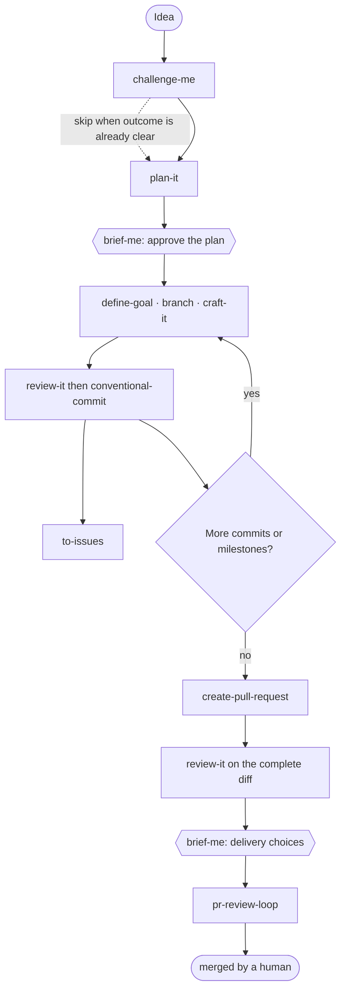

# Typeweaver Skills

A small collection of composable software-engineering skills and thin agent
adapters. The reusable behavior lives in skills; agents add execution context,
tool boundaries, and context isolation for supported harnesses.

## Install

Use the official Typeweaver installer for skills and native agent adapters:

```bash
npx typeweaver-skills install
```

It supports Claude Code, Codex, OpenCode, and Kiro. See the
[CLI guide](cli/README.md) for flags, symlink and copy modes, updates, and
uninstall.

Install skills only with the Agent Skills CLI:

```bash
npx skills@latest add typeweaver/skills
```

Native Typeweaver agent adapters require the official installer or the
repository linker below.

For local development, preview or create symlinks from this checkout into the
shared agent skills directory (`~/.agents/skills`, read by Codex and other
harnesses) and the Claude Code skills directory (`~/.claude/skills`):

```bash
./scripts/link-skills.sh --dry-run
./scripts/link-skills.sh
```

The linker preserves existing directories and unrelated symlinks. Run
`./scripts/link-skills.sh --help` for custom destinations and explicit symlink
replacement.

To switch this machine from CLI-installed copies to the live checkout, preview
and then replace only entries whose names belong to this repository:

```bash
./scripts/link-skills.sh --dry-run --replace-existing
./scripts/link-skills.sh --replace-existing
```

The normal command remains non-destructive. `--replace-existing` removes the
matching installed entries before linking them to this checkout. Running
`npx skills@latest add typeweaver/skills` again and confirming the overwrite
restores the published version. A later CLI update may do the same while local
links are active.

## Agents

Install the native agent adapters from a checkout of this repository (the same
path serves local development):

```bash
./scripts/link-agents.sh --dry-run
./scripts/link-agents.sh
```

Claude Code and OpenCode receive live symlinks. Codex profiles and custom agents
are copied; rerun the linker after a Codex adapter changes.

- **[aurelius-drive](agents/aurelius-drive/codex-profile.toml)** — Explicit primary mode
  that adopts Aurelius and starts the complete Drive It workflow. Claude Code
  and OpenCode provide native primary-agent selection; Codex provides an
  equivalent profile selected with `codex --profile aurelius-drive`.
- **[review-it](agents/review-it/codex.toml)** — Fresh, read-only reviewer used
  by the orchestrator before commits and over the complete pull-request diff.

See the [agent catalog](agents/README.md) for harness adapters and usage.

## Workflow

`drive-it` orchestrates the flow below when explicitly invoked; `aurelius` is
the companion mindset throughout. Hexagons are human checkpoints.



The skills stay useful independently. The workflow only shows how they compose
for a complete engineering handoff. When explicitly invoked, `drive-it` resumes
at the earliest incomplete phase and coordinates the flow until a human merges
the pull request. Use `brief-me` at any point for a concise snapshot of the current
plan, decisions, implementation status, or final delivery. Expert personas such
as `ask-rich-hickey` may be invoked explicitly or selected when their distinct
lens is likely to materially improve the outcome. They shape the reasoning
without replacing the active workflow or its output structure. External issues
are created only after separate user authorization at the delivery checkpoint.

## Skills

### Engineering

- **[aurelius](skills/engineering/aurelius/SKILL.md)** — Bring a trusted senior
  engineering companion into systems, architecture, and consequential decisions.
- **[drive-it](skills/engineering/drive-it/SKILL.md)** — Orchestrate the full
  engineering workflow from an idea to a merged pull request.
- **[ask-rich-hickey](skills/engineering/ask-rich-hickey/SKILL.md)** — Judge a
  software problem through Rich Hickey's engineering mindset.
- **[ask-martin-fowler](skills/engineering/ask-martin-fowler/SKILL.md)** — Judge
  evolving software through Martin Fowler's engineering mindset.
- **[ask-kent-beck](skills/engineering/ask-kent-beck/SKILL.md)** — Judge a
  change through Kent Beck's feedback-oriented engineering mindset.
- **[ask-john-ousterhout](skills/engineering/ask-john-ousterhout/SKILL.md)** —
  Judge software complexity through John Ousterhout's engineering mindset.
- **[ask-barbara-liskov](skills/engineering/ask-barbara-liskov/SKILL.md)** —
  Judge abstractions and contracts through Barbara Liskov's engineering
  mindset.
- **[ask-linus-torvalds](skills/engineering/ask-linus-torvalds/SKILL.md)** —
  Judge code, interfaces, and patches through Linus Torvalds's engineering
  mindset.
- **[ask-donald-knuth](skills/engineering/ask-donald-knuth/SKILL.md)** — Judge
  algorithms and programs through Donald Knuth's engineering mindset.
- **[challenge-me](skills/engineering/challenge-me/SKILL.md)** — Shape an unclear
  problem into a shared, challenged understanding.
- **[plan-it](skills/engineering/plan-it/SKILL.md)** — Turn shared understanding
  into a durable, handoff-ready engineering plan.
- **[craft-it](skills/engineering/craft-it/SKILL.md)** — Implement maintainable,
  repository-native software with durable contracts and tests.
- **[comment-it](skills/engineering/comment-it/SKILL.md)** — Write durable
  source-code comments without narrating what the code already says.
- **[nextjs-feature-architecture](skills/engineering/nextjs-feature-architecture/SKILL.md)**
  — Design scalable Next.js App Router features with explicit ownership and
  runtime boundaries.
- **[brief-me](skills/engineering/brief-me/SKILL.md)** — Summarize a discussion,
  plan, implementation, or reviewed delivery at the right level of detail.
- **[review-it](skills/engineering/review-it/SKILL.md)** — Independently review
  an intended change or complete pull request.
- **[define-goal](skills/engineering/define-goal/SKILL.md)** — Turn a request
  into a concise, verifiable goal and stopping condition.
- **[to-issues](skills/engineering/to-issues/SKILL.md)** — Record actionable
  work locally and synchronize it externally when authorized.
- **[conventional-commit](skills/engineering/conventional-commit/SKILL.md)** —
  Create coherent Git commit boundaries and Conventional Commit messages.
- **[create-pull-request](skills/engineering/create-pull-request/SKILL.md)** —
  Verify completed work and create or update a focused pull request.
- **[pr-review-loop](skills/engineering/pr-review-loop/SKILL.md)** — Handle
  review feedback and checks until a pull request is merged or blocked.

See the [engineering catalog](skills/engineering/README.md) for invocation
details.

## License

Released under the [MIT License](LICENSE).
