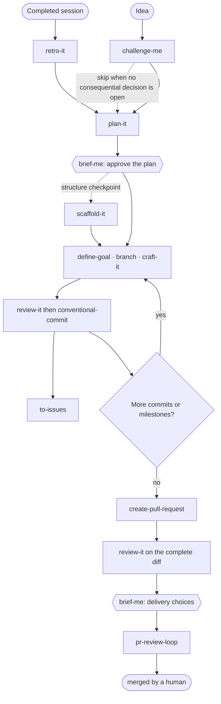

# Skill your Agents

Opinionated software-engineering skills and thin agent adapters for coding
agents. Install them with `equip-it`. The skills encode one way of working:
challenge the idea, plan, craft, review, commit, deliver. They are deliberately
specific rather than neutral, and every line has to change what the agent does;
see the [skill philosophy](docs/skill-philosophy.md). Reusable behavior lives
in skills; agents add execution context, tool boundaries, and context isolation
for supported harnesses.

## Install

Install the skills and native agent adapters with `equip-it`:

```bash
npx equip-it install
```

It supports Claude Code, Codex, OpenCode, and Kiro. See the
[CLI guide](cli/README.md) for flags, symlink and copy modes, updates, and
uninstall.

Install skills only with the Agent Skills CLI:

```bash
npx skills@latest add typeweaver/skills
```

Native agent adapters require `equip-it` or the repository linker below.

For local development, preview or create symlinks from this checkout into the
shared agent skills directory (`~/.agents/skills`, read by Codex and other
harnesses) and the Claude Code skills directory (`~/.claude/skills`):

```bash
./scripts/link-skills.sh --dry-run
./scripts/link-skills.sh
```

The linker preserves existing directories and unrelated symlinks. Run
`./scripts/link-skills.sh --help` for custom destinations and explicit symlink
replacement.

To switch this machine from CLI-installed copies to the live checkout, preview
and then replace only entries whose names belong to this repository:

```bash
./scripts/link-skills.sh --dry-run --replace-existing
./scripts/link-skills.sh --replace-existing
```

The normal command remains non-destructive. `--replace-existing` removes the
matching installed entries before linking them to this checkout. Running
`npx skills@latest add typeweaver/skills` again and confirming the overwrite
restores the published version. A later CLI update may do the same while local
links are active.

## Agents

Install the native agent adapters from a checkout of this repository (the same
path serves local development). Install the skills first: agents route to
repository skills at runtime, and `link-agents.sh` installs adapters only.

```bash
./scripts/link-skills.sh --dry-run
./scripts/link-skills.sh
./scripts/link-agents.sh --dry-run
./scripts/link-agents.sh
```

Claude Code and OpenCode receive live symlinks. Codex profiles and custom agents
are copied; rerun the linker after a Codex adapter changes.

- **[aurelius-drive](agents/aurelius-drive/codex-profile.toml)** — Explicit primary mode
  that adopts Aurelius and starts the complete Drive It workflow. Every harness
  receives the canonical `aurelius` and `drive-it` content inline as startup
  context, then routes to the installed repository skills. Codex selects it with
  `codex --profile aurelius-drive`.
- **[review-it](agents/review-it/codex.toml)** — Fresh, read-only reviewer used
  by the orchestrator before commits and over the complete pull-request diff.

See the [agent catalog](agents/README.md) for harness adapters and usage.

## Workflow

`drive-it` orchestrates the flow below when explicitly invoked; `aurelius` is
the companion mindset throughout. Hexagons are human checkpoints.



The skills stay useful independently. The workflow only shows how they compose
for a complete engineering handoff. When explicitly invoked, `drive-it` resumes
at the earliest incomplete phase and coordinates the flow until a human merges
the pull request. For instruction improvements from a completed session,
`drive-it` uses `retro-it`'s proposed changes as the implementation source, then
continues through the same plan, build, review, commit, and pull-request phases.
Use `brief-me` at any point for a concise snapshot of the current plan,
decisions, implementation status, or final delivery. Expert personas such as
`ask-rich-hickey` apply where their own description says they do. They shape the
reasoning without replacing the active workflow or its output structure.
External issues are created only after separate user authorization at the
delivery checkpoint.

## Skills

### Engineering

- **[aurelius](skills/engineering/aurelius/SKILL.md)** — Adopt a candid senior
  engineer who recommends one option with its decisive tradeoff and owns the
  outcome inside the approved scope.
- **[drive-it](skills/engineering/drive-it/SKILL.md)** — Orchestrate the full
  engineering workflow from an idea or retrospective findings to a merged pull
  request.
- **[retro-it](skills/engineering/retro-it/SKILL.md)** — Trace every correction
  in a finished session to its cause and propose the exact instruction change.
- **[ask-rich-hickey](skills/engineering/ask-rich-hickey/SKILL.md)** — Judge a
  design decision through Rich Hickey's engineering mindset.
- **[ask-martin-fowler](skills/engineering/ask-martin-fowler/SKILL.md)** — Judge
  a change to existing software through Martin Fowler's engineering mindset.
- **[ask-kent-beck](skills/engineering/ask-kent-beck/SKILL.md)** — Judge a
  change through Kent Beck's feedback-oriented engineering mindset.
- **[ask-john-ousterhout](skills/engineering/ask-john-ousterhout/SKILL.md)** —
  Judge a software design through John Ousterhout's engineering mindset.
- **[ask-barbara-liskov](skills/engineering/ask-barbara-liskov/SKILL.md)** —
  Judge an abstraction through Barbara Liskov's engineering mindset.
- **[ask-linus-torvalds](skills/engineering/ask-linus-torvalds/SKILL.md)** —
  Judge code, interfaces, and patches through Linus Torvalds's engineering
  mindset.
- **[ask-donald-knuth](skills/engineering/ask-donald-knuth/SKILL.md)** — Judge
  an algorithm or a program through Donald Knuth's engineering mindset.
- **[challenge-me](skills/engineering/challenge-me/SKILL.md)** — Stress-test an
  idea in rounds until every consequential decision is settled.
- **[plan-it](skills/engineering/plan-it/SKILL.md)** — Turn a settled approach
  into ordered steps, each with a check that proves it done.
- **[scaffold-it](skills/engineering/scaffold-it/SKILL.md)** — Lay out the
  files, signatures, and test cases of a plan for structure approval before
  implementing.
- **[craft-it](skills/engineering/craft-it/SKILL.md)** — Build the smallest
  complete change for an agreed outcome, with tests that fail without it.
- **[debug-it](skills/engineering/debug-it/SKILL.md)** — Diagnose a defect from
  a red reproduction loop to a confirmed cause and a regression test.

- **[comment-it](skills/engineering/comment-it/SKILL.md)** — Write durable
  source-code comments without narrating what the code already says.
- **[document-it](skills/engineering/document-it/SKILL.md)** — Write a document
  that answers its reader's questions, place it where developers and agents
  look, and keep the docs map current.
- **[guard-it](skills/engineering/guard-it/SKILL.md)** — Set up machine-enforced
  checks in a TypeScript project that fail CI on detectable defects and
  complexity drift, and prove that each one fires.
- **[nextjs-feature-architecture](skills/engineering/nextjs-feature-architecture/SKILL.md)**
  — Decide where each part of a Next.js App Router feature lives, from the
  route contract to the state owner.
- **[brief-me](skills/engineering/brief-me/SKILL.md)** — Re-orient a reader on
  a discussion, plan, implementation, or reviewed delivery in one read.
- **[review-it](skills/engineering/review-it/SKILL.md)** — Review a code change
  or pull request diff and return findings that name what breaks, backed by
  the diff.
- **[define-goal](skills/engineering/define-goal/SKILL.md)** — Turn a request
  into one goal an agent can work against alone, with its completion evidence
  and stop condition.
- **[to-issues](skills/engineering/to-issues/SKILL.md)** — Record actionable
  work in exactly one place: an authorized tracker, or local files.
- **[conventional-commit](skills/engineering/conventional-commit/SKILL.md)** —
  Create Conventional Commits whose split and message follow from the diff.
- **[create-pull-request](skills/engineering/create-pull-request/SKILL.md)** —
  Open or update a branch's pull request with the context a reviewer needs.
- **[pr-review-loop](skills/engineering/pr-review-loop/SKILL.md)** — Work an
  open pull request's review comments and checks until a human merges it.

See the [engineering catalog](skills/engineering/README.md) for invocation
details.

## License

Released under the [MIT License](LICENSE).
